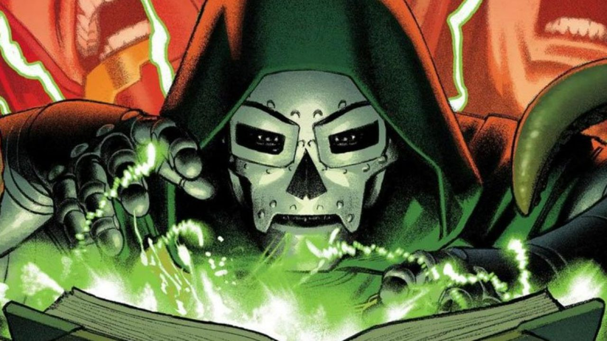

# Operation: Doomsday editor

<h6 align="center">The Doomsday markdown editor.<h6/>

## Todo:

###### Features

- [ ] export to pdf and html.
- [ ] Real Files on Filetree view.
- [x] Save files on local. (_Need to be fixed?_)
- [x] Hot reload on Preview section.
- [x] File tree section and make it toggle.
- [x] Close buttons in navbar.
- [x] Add a footer with file information. (_on proccess_)
- [x] Add a tabbar.

###### Fix

- [x] Editor initial width.
- [ ] Change the colorscheme.
- [x] Preview auto witdh.
